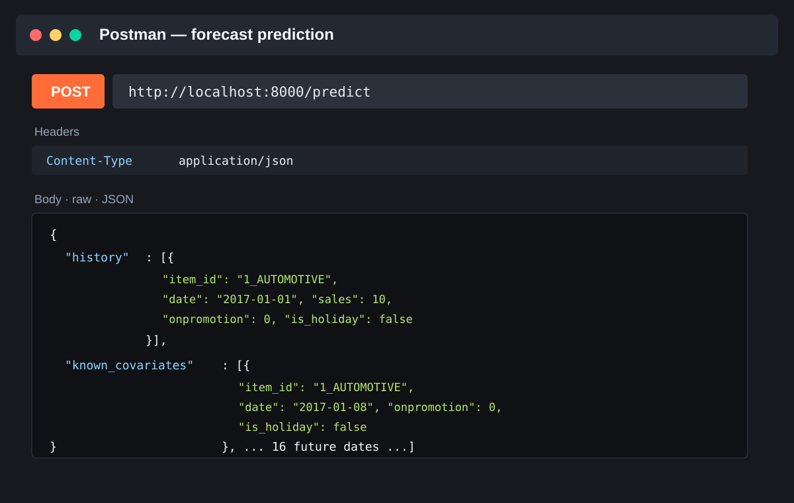

# AutoGluon MLOps

This repository trains AutoGluon TimeSeries models with ZenML, publishes complete predictor directories to S3/MinIO, and serves them through a generic FastAPI container. Training and online serving have separate environments and release lifecycles.

## Repository layout

```text
pipelines/training/              ZenML data, training, evaluation, gate, package, upload
pipelines/data/                  Feature engineering pipeline
serving/app/                     Standalone FastAPI application
serving/Dockerfile               Generic model-version-independent image
scripts/promote_model.py         Production pointer promotion/rollback
infrastructure/docker/           Local ZenML, MLflow, and MinIO stack
```

## Training flow

```text
load_data -> split/preprocess -> train -> evaluate -> quality_gate
          -> package full predictor directory -> upload model.tar.gz
          -> model_uri, model_version, metrics
```

The training command does not build an image or update production. Configure the artifact destination with `MODEL_NAME`, `MODEL_VERSION`, `MODEL_BUCKET`, `S3_ENDPOINT_URL`, `S3_ACCESS_KEY`, `S3_SECRET_KEY`, and `S3_REGION`.

```bash
cp .env.example .env
make dev-stack-up
MODEL_VERSION=v19 make train-pipeline
```

The resulting URI has this form:

```text
s3://ml-models/store-sales/v19/model.tar.gz
```

The archive contains the complete AutoGluon predictor directory under `model/` and a `manifest.json` with framework, Python, AutoGluon, model version, and predictor checksum metadata.

## Serving

At startup the container reads `MODEL_URI`, downloads the archive once, verifies `MODEL_SHA256` when set, extracts it to `MODEL_CACHE_DIR`, reads the manifest, and calls `TimeSeriesPredictor.load()`. Requests use only the loaded in-memory predictor.

Build and run the generic image:

```bash
docker build -t autogluon-server:1.0.0 serving
docker run --rm -p 8000:8000 \
  -e MODEL_URI=s3://ml-models/store-sales/v19/model.tar.gz \
  -e S3_ENDPOINT_URL=http://host.docker.internal:9000 \
  -e S3_ACCESS_KEY=minioadmin \
  -e S3_SECRET_KEY=local-dev-minio \
  autogluon-server:1.0.0
```

Required endpoints:

```text
GET  /health     process liveness
GET  /ready      model readiness
GET  /metadata   loaded model metadata
POST /predict    forecast request
```

Example request: use the complete JSON body in the Postman section below. The
`known_covariates` array must contain every future date required by the loaded
model; a single future row is intentionally not a valid forecast request.

### Postman



Create a request with:

```text
Method: POST
URL: http://localhost:8000/predict
Header: Content-Type: application/json
Body: raw / JSON
```

Use a `known_covariates` row for every future time step. The current model has
`prediction_length=16`, so the request must include the next 16 daily dates after
the final date in `history`.

```json
{
  "history": [
    {"item_id": "1_AUTOMOTIVE", "date": "2017-01-01", "sales": 10, "onpromotion": 0, "is_holiday": false},
    {"item_id": "1_AUTOMOTIVE", "date": "2017-01-02", "sales": 12, "onpromotion": 1, "is_holiday": false},
    {"item_id": "1_AUTOMOTIVE", "date": "2017-01-03", "sales": 11, "onpromotion": 0, "is_holiday": false},
    {"item_id": "1_AUTOMOTIVE", "date": "2017-01-04", "sales": 13, "onpromotion": 0, "is_holiday": false},
    {"item_id": "1_AUTOMOTIVE", "date": "2017-01-05", "sales": 14, "onpromotion": 1, "is_holiday": false},
    {"item_id": "1_AUTOMOTIVE", "date": "2017-01-06", "sales": 12, "onpromotion": 0, "is_holiday": false},
    {"item_id": "1_AUTOMOTIVE", "date": "2017-01-07", "sales": 15, "onpromotion": 0, "is_holiday": false}
  ],
  "known_covariates": [
    {"item_id": "1_AUTOMOTIVE", "date": "2017-01-08", "onpromotion": 0, "is_holiday": false},
    {"item_id": "1_AUTOMOTIVE", "date": "2017-01-09", "onpromotion": 0, "is_holiday": false},
    {"item_id": "1_AUTOMOTIVE", "date": "2017-01-10", "onpromotion": 1, "is_holiday": false},
    {"item_id": "1_AUTOMOTIVE", "date": "2017-01-11", "onpromotion": 0, "is_holiday": false},
    {"item_id": "1_AUTOMOTIVE", "date": "2017-01-12", "onpromotion": 0, "is_holiday": false},
    {"item_id": "1_AUTOMOTIVE", "date": "2017-01-13", "onpromotion": 0, "is_holiday": false},
    {"item_id": "1_AUTOMOTIVE", "date": "2017-01-14", "onpromotion": 1, "is_holiday": false},
    {"item_id": "1_AUTOMOTIVE", "date": "2017-01-15", "onpromotion": 0, "is_holiday": false},
    {"item_id": "1_AUTOMOTIVE", "date": "2017-01-16", "onpromotion": 0, "is_holiday": false},
    {"item_id": "1_AUTOMOTIVE", "date": "2017-01-17", "onpromotion": 0, "is_holiday": false},
    {"item_id": "1_AUTOMOTIVE", "date": "2017-01-18", "onpromotion": 1, "is_holiday": false},
    {"item_id": "1_AUTOMOTIVE", "date": "2017-01-19", "onpromotion": 0, "is_holiday": false},
    {"item_id": "1_AUTOMOTIVE", "date": "2017-01-20", "onpromotion": 0, "is_holiday": false},
    {"item_id": "1_AUTOMOTIVE", "date": "2017-01-21", "onpromotion": 0, "is_holiday": false},
    {"item_id": "1_AUTOMOTIVE", "date": "2017-01-22", "onpromotion": 1, "is_holiday": false},
    {"item_id": "1_AUTOMOTIVE", "date": "2017-01-23", "onpromotion": 0, "is_holiday": false}
  ]
}
```

For local Compose, set `MODEL_URI` and run `make serve-api`. The same image can run with any compatible model version; model files are never copied into the image.

## Promotion and rollback

Promotion validates that the artifact exists and writes a pointer such as:

```json
{
  "version": "v19",
  "artifact_uri": "s3://ml-models/store-sales/v19/model.tar.gz"
}
```

```bash
MODEL_VERSION=v19 \
MODEL_URI=s3://ml-models/store-sales/v19/model.tar.gz \
MODEL_SHA256=<archive-sha256> \
PRODUCTION_POINTER_URI=s3://ml-models/store-sales/production.json \
make promote-model
```

Promotion updates the immutable production pointer. Deploy the selected URI separately with `make deploy-model`, then wait for `/ready` and smoke-test `/predict`. Rollback uses the same promotion command with the previous immutable artifact URI:

```bash
uv run python scripts/promote_model.py rollback \
  --version v18 \
  --artifact-uri s3://ml-models/store-sales/v18/model.tar.gz \
  --pointer-uri s3://ml-models/store-sales/production.json
```

## Verification

```bash
uv run ruff check .
uv run pytest --cov=mlops_project
uv run pytest serving/tests -q
docker build --no-cache -t autogluon-server:test serving
rg -n -i --hidden -g '!**/.git/**' 'bento|bentoml' .
git diff --check
```
